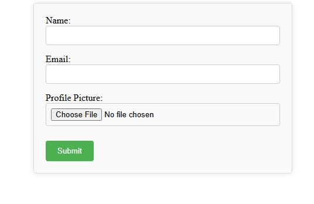
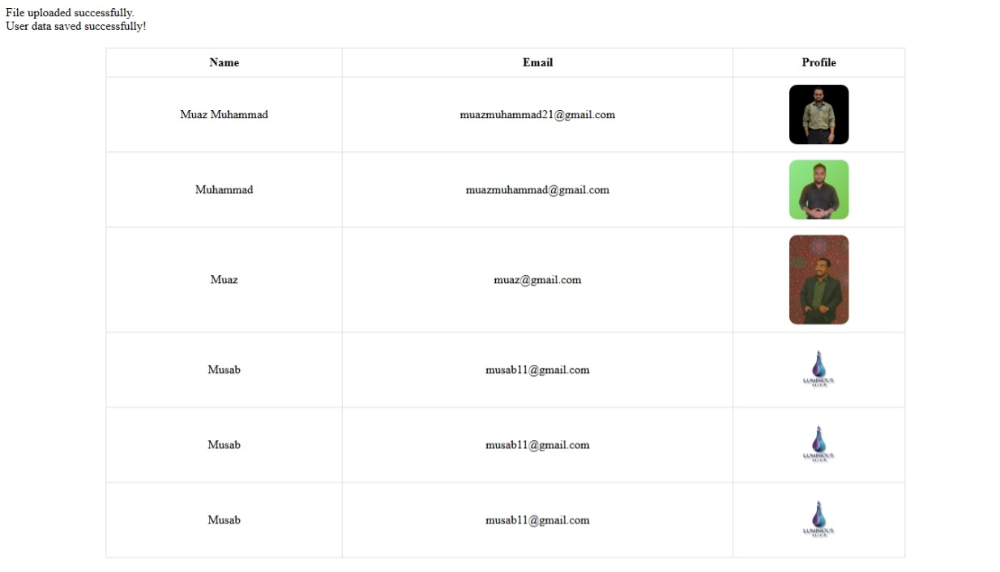

# 🧪 **Day 14: Review & Debugging + Data Display**

---

## 🧠 What You’ll Learn Today:

- How to review and clean up code 🧹  
- How to debug common PHP issues 🔍  
- How to read and display user data from `userdata.txt` in a beautiful table 📄➡️📊  

---

## 🔍 Step 1: Common PHP Debugging Tips

### ✅ 1. Always Turn On Error Reporting (While Developing)

```php
ini_set('display_errors', 1);
error_reporting(E_ALL);
```

### ✅ 2. Use `var_dump()` or `print_r()` to Inspect Variables

```php
var_dump($_POST);
print_r($_FILES);
```

### ✅ 3. Use `die()` or `exit()` to Stop Code at a Point

```php
if (!$fileUploaded) {
  die("Upload failed. Debug info: " . print_r($_FILES, true));
}
```

---

## 🔧 Step 2: Fixing Common Mistakes

| 🔴 Problem | ✅ Fix |
|-----------|--------|
| File not saving | Check file permissions (`chmod`) |
| Upload failed | Ensure `enctype="multipart/form-data"` |
| Form not submitting | Check input names and `$_POST` keys |
| File gets overwritten | Use unique names (e.g., `time()`) |

---

## 🖼️ Step 3: Display All Saved Users from `userdata.txt`

You’ll now learn how to **read the log** from the file and show it in a neat HTML table:

```php
<?php
$data = file_get_contents("userdata.txt");
$entries = explode("\n\n", trim($data)); // Split into blocks

echo "<table border='1' cellpadding='10'>";
echo "<tr><th>Name</th><th>Email</th><th>Profile</th></tr>";

foreach ($entries as $entry) {
    $lines = explode("\n", $entry);
    $name = str_replace("Name: ", "", $lines[0]);
    $email = str_replace("Email: ", "", $lines[1]);
    $profile = str_replace("Profile: ", "", $lines[2]);

    echo "<tr>";
    echo "<td>$name</td>";
    echo "<td>$email</td>";
    echo "<td></td>";
    echo "</tr>";
}

echo "</table>";
?>
```

> 💡 This gives you a **dashboard**-like view of your user submissions.

---
# Output
**Submit Form**

**Dashboard**


## 💬 Q&A Section

🔸 **Q1: What if the file gets too big?**  
👉 You can limit data using `array_slice()` or store only the latest 100 records.

---

🔸 **Q2: How to show errors if something goes wrong?**  
👉 Add `or die("Error Message")` after a function:
```php
$file = fopen("userdata.txt", "a") or die("Unable to open file!");
```

---

🔸 **Q3: Can I convert `userdata.txt` to CSV format later?**  
✅ Absolutely! Just use `fputcsv()` instead of `fwrite()` for writing data.

---

## 💡 Tips & Tricks

- ✏️ Add timestamps to your saved logs for tracking:
```php
$time = date("Y-m-d H:i:s");
$log = "Name: $name\nEmail: $email\nProfile: $targetFile\nTime: $time\n\n";
```

- ✅ Create a backup of `userdata.txt` before doing anything major:
```php
copy("userdata.txt", "backup_userdata.txt");
```

- 🎨 Add CSS to make the output table look better:
```html
<style>
table { border-collapse: collapse; width: 80%; margin: 20px auto; }
th, td { border: 1px solid #ddd; padding: 10px; text-align: center; }
img { border-radius: 10px; }
</style>
```

---

## ✅ Summary

- Debugged and improved our previous code  
- Learned how to display `.txt` file data in a clean format  
- Practiced working with file reading, splitting, and HTML output

